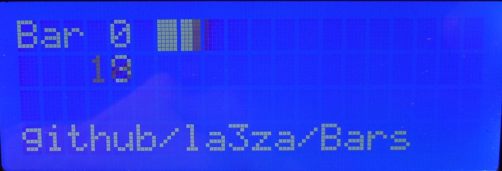
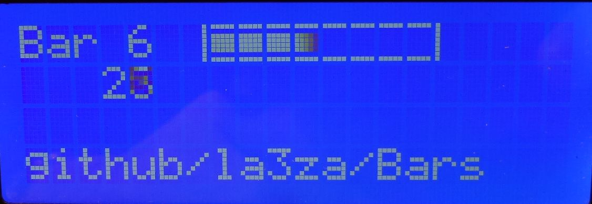

# Bars
This is an implementation of a collection of different progressbars or bargraphs for Arduino using customized LCD character sets. Bars can start and stop on user-selectable columns. 
 
The main design principle is that no more than 8 custom characters should be required per bar. That means that the custom character set is uploaded just once for each bar, giving much less probability for wearing out the LCD character memory with its limit on the number of write cycles. This excludes some fancier bars that require more or less continuous updates of character sets during progression of the bar.

## The different bars implemented

The demonstration program was developed for an Arduino Mega with a 20 x 4 LCD, but runs equally well on any Arduino and a 16 x 2 LCD.
